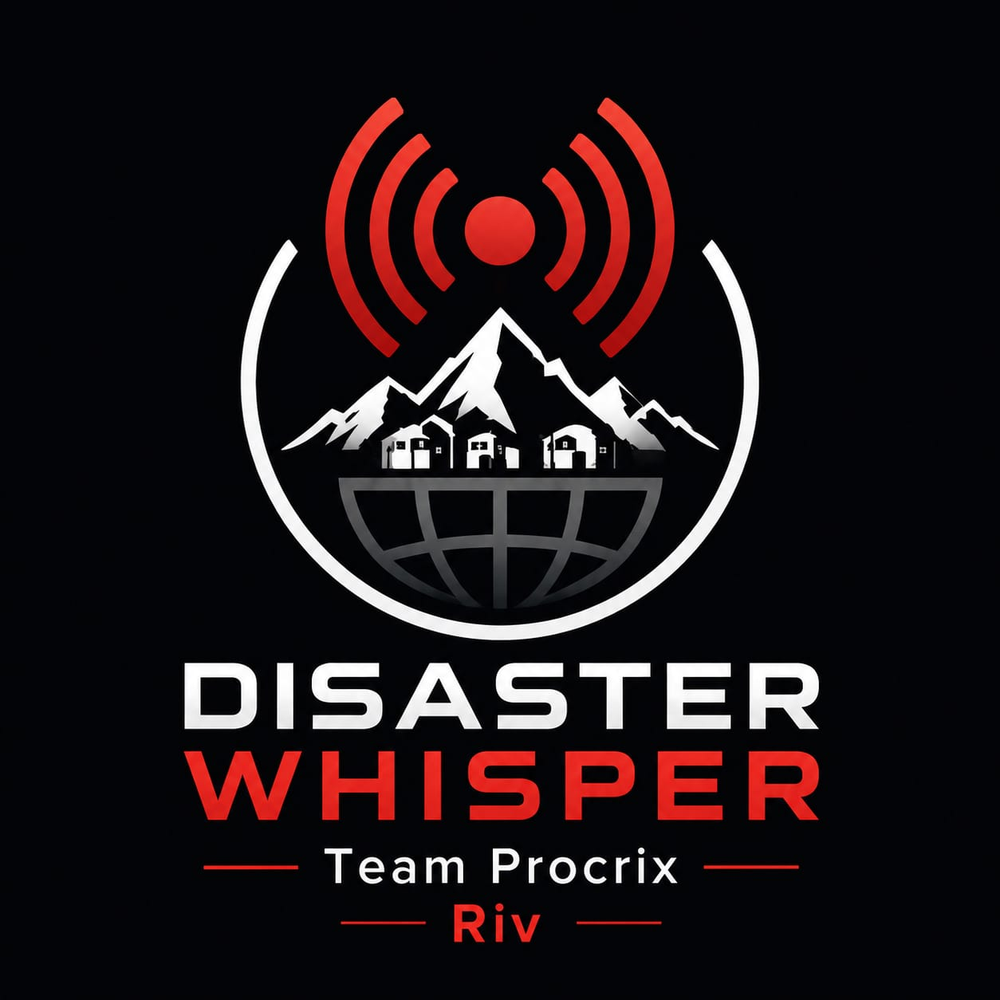

<div align="center">
  
  <h1>Disaster-Whisper</h1>
  <p><strong>Offline-First, Asymmetric Emergency Communication & Alerting System</strong></p>
  <p><i>A research backed proof of concept demostrating our proposed contribution to government disaster management developed as a prototype for SIH.</i></p>
</div>

<hr />

## 📖 Overview

**Disaster-Whisper** is a publication-quality emergency communication framework designed to operate over heavily congested or completely offline communication channels (e.g., SMS, Cell Broadcast, LoRa, BLE Mesh). 

During major disasters (floods, cyclones, earthquakes), internet connectivity is the first infrastructure to collapse. Disaster-Whisper solves this by compressing complex multi-point evacuation routes and targeted disaster metadata into a **sub-30-byte micro-payload**. This tiny payload is broadcasted over resilient, low-bandwidth airwaves and reconstructed on edge devices (smartphones) into rich, context-aware, and localized alerts—all without requiring an active internet connection.

## Key Innovation: The Asymmetric Pipeline

Our system leverages an **Asymmetric Computational Model**:
- **Heavy Server (Command Center):** Performs intensive geospatial calculations, OpenStreetMap routing, Ramer-Douglas-Peucker (RDP) simplification, and ultra-dense binary compression.
- **Lightweight Edge (Citizen Smartphone):** Receives the micro-payload, decodes it instantly, and uses **Zero-Dependency Deterministic Templates** to synthesize critical guidance logs on the device locally.

## Features

*   **Geodetic Compression Codec:** Compresses Google Maps/OSM polylines to 4-decimal precision (~11m accuracy), squeezing up to 5 waypoints, hazard type, and target audience into just 28 characters.
*   **Fully Offline Alerts:** The client app translates the cryptic payload into a rich warning using an offline template engine—no API calls needed.
*   **Offline Localized Templates:** Core emergency routes and instructions are translated completely offline. We used `deep-translator` at build-time to hard-code 22 distinct regional Indian languages into localized JSON templates, ensuring victims receive alerts in their native tongue without requiring a single API call.
*   **Hands-Free Automation:** Client dashboard auto-scans for new broadcasts, auto-decodes the payload, and automatically triggers an offline Text-to-Speech (TTS) engine to read the warning aloud.
*   **Asymmetric AI Architecture:** The system gracefully scales based on the victim's hardware. Low-end devices use the deterministic Tier-1 JSON templates. High-end devices (4GB+ RAM) execute a Tier-2 offline Small Language Model (e.g., Qwen-1.8B) to synthesize conversational alerts directly on the CPU.
*   **Hallucination Validator:** A hardcoded safety gate (`client/validator.py`) intercepts the on-device AI output and cross-checks it against a verified local landmark registry, eliminating AI-invented locations before they reach the user.
*   **Instant SOS Uplink:** A one-tap emergency beacon that queues a geolocation ping for rescuers when a cellular packet window opens.

## System Architecture

### 1. Server-Side Pipeline (Government Command Station)
1. **Route Optimizer:** Takes a set of street-level waypoints, validates bounds, and simplifies the corridor.
2. **Payload Encoder:** Compresses route coordinates, hazard classification, and targeted audience groups into a 4-part compact string layout: `[Hazard_Code][Role_Flag][Polyline_Payload][Checksum]`
3. **Broadcaster:** Dispatches the encrypted payload alongside an optional fallback plain-text message.

### 2. Client-Side Pipeline (Citizen PWA)
1. **Signal Ingestion:** Auto-scans local airwaves or parses SMS clipboard segments to circumvent OS sandboxes.
2. **Decoder & Integrity Gate:** Verifies the XOR checksum. If corrupted by signal interference, the payload is rejected.
3. **Template Engine:** Expands the tiny payload into a localized, human-readable evacuation plan.

## 📂 Project Structure & Scale

To ensure true offline survivability and localized accessibility without internet, the codebase is significantly scaled out:

*   **22+ Localized Templates (`data/`):** We have engineered 22 distinct JSON template files (e.g., `templates_as.json` for Assamese, `templates_ta.json` for Tamil) allowing the offline tier-1 engine to dynamically generate emergency alerts in almost every major regional Indian language without hitting a translation API.
*   **Dual-Dashboard Architecture (`templates/`):** 
    *   `client.html`: The fully isolated Progressive Web App (PWA) for citizen smartphones.
    *   `server.html`: The HQ Command Center dashboard featuring interactive Leaflet mapping.
*   **Live SOS Telemetry & Rescue Uplink:** Built directly into the routing engine (`app.py`), citizen phones use standard geolocation to ping `/api/sos`, which HQ monitors in real-time via AJAX polling on the server dashboard for SOS coordination and status monitoring.

## Tech Stack

*   **Backend:** Python 3.13, Flask
*   **Frontend:** Vanilla JavaScript, CSS3 (Glassmorphism UI), HTML5
*   **Mapping:** Leaflet.js with OpenStreetMap (OSM) Tiles
*   **APIs/Libraries:** Overpass API (Used at build-time to cache Hospital/Police nodes into the local offline registry), `deep-translator`
*   **Architecture:** Progressive Web App (PWA) with Service Worker caching

## Setup & Installation

Create a Python virtual environment and install the required dependencies:

```bash
# 1. Clone the repository and navigate into it
cd Disaster-Whisper

# 2. Create a virtual environment
python -m venv venv

# 3. Activate the environment
# Windows:
.\venv\Scripts\activate
# Linux/macOS:
source venv/bin/activate

# 4. Install requirements
pip install -r requirements.txt
pip install deep-translator
```

## Testing & Verification
We have built a robust automated test suite covering the entire pipeline.
```bash
python -m pytest tests/ -v
```

## Running the SIH Prototype

**Step 1: Start the Centralized Server**
```bash
python app.py
```

**Step 2: Access the Dashboards**
Open your web browser (preferably in **Incognito/Private mode** to avoid PWA cache interference during development) and navigate to:
*   **Command Center:** [http://127.0.0.1:5000/server](http://127.0.0.1:5000/server)
*   **Citizen App:** [http://127.0.0.1:5000/client](http://127.0.0.1:5000/client)

**Step 3: The Demo Workflow**
1. On the **Server** tab, select a Hazard (e.g., Flood), click 3-5 points on the map to draw a route, and type a custom HQ message.
2. Click **Broadcast Alert**.
3. Switch to the **Client** tab. The app will automatically scan, intercept the broadcast, decode the map coordinates, translate the HQ message, and read the alert aloud!

